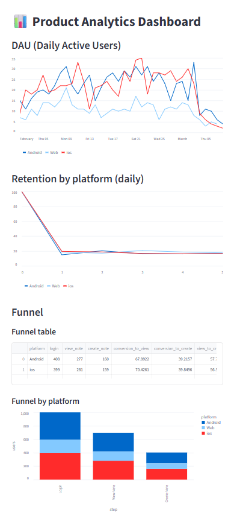

# 📊 Дашборд анализа вовлеченности и удержания пользователей

## 📌 Описание проекта
Дашборд продуктовой аналитики для анализа поведения пользователей: DAU, retention и воронка конверсии.  
Данные сгенерированы и загружены в PostgreSQL.
Проект развернут на VPS (Ubuntu).   
Автоматически стартует после перезагрузки сервера  

Доступ к дашборду:  
http://46.149.77.76:8501

Все сервисы работают в Docker-контейнерах: 
- app (Streamlit)
- db (PostgreSQL)

---

## 🛠️ Стек

- Python   
- Streamlit   
- PostgreSQL   
- Docker  
- VPS (Ubuntu)   

---

## ⚙️ Что сделано

- Сгенерированы пользовательские события (`login`, `view_note`, `create_note`)
- Смоделировано распределение платформ (iOS / Android / Web)
- Данные сохранены в volume docker-контейнера и загружены в PostgreSQL
- Реализованы SQL-запросы для расчета метрик
- Построен дашборд в Streamlit
- Добавлена сегментация по платформам
- Настроен деплой на VPS
- Контейнеризация приложения с помощью Docker

---

## 📦 Данные

Данные сгенерированы с помощью Python-скрипта:

- ~1000 пользователей  
- случайное распределение событий  
- платформы: iOS / Android / Web  
- временной диапазон до нескольких дней после первого события

---

## 📈 Метрики

- **DAU (Daily Active Users)** — количество активных пользователей в день  
- **Retention** — возвращаемость пользователей по дням  
- **Funnel Conversion** — конверсия по шагам: login → view_note → create_note

---

## 📊 Основные выводы

- Retention резко падает после первого дня (~20%), так как по логике работы нашего генератора, событие с одинаковым шансом событие может произойти через 1, 2, 3, 4 или 5 дней, и retention получается “плоским”. А в реальных данных большинство пользователей быстро уходят, и активность затухает экспоненциально
- Поведение пользователей на разных платформах в целом схоже  
- Конверсия в целевое действие (create_note) составляет ~40–45%  
- Основные потери происходят между шагами `view_note → create_note`  
